# TradeX Trading Package — Architecture Reference

> **Package**: `tradex-trading` v0.1.0
> **Python**: ≥ 3.12
> **License**: Proprietary
> **Last updated**: 2026-08-07

---

## Table of Contents

1. [Executive Summary](#1-executive-summary)
2. [Complete File Hierarchy](#2-complete-file-hierarchy)
3. [Package Dependency Graph](#3-package-dependency-graph)
4. [Module Architecture](#4-module-architecture)
5. [Component Diagrams](#5-component-diagrams)
6. [Data Flow Diagrams](#6-data-flow-diagrams)
7. [Runtime Lifecycle](#7-runtime-lifecycle)
8. [Configuration Reference](#8-configuration-reference)
9. [Extension Contract](#9-extension-contract)
10. [Test Organization](#10-test-organization)

---

## 1. Executive Summary

`tradex-trading` is the **application layer** of the TradeX v4 broker-agnostic trading platform for Indian markets (NSE, BSE, MCX). It provides the reactive execution engine, order management system (OMS), strategy framework, analytics pipeline, data lake, backtesting/replay engine, SDK session, and all user-facing interfaces (CLI, HTTP API, TUI).

### Position in the 3-Package Architecture

```
┌─────────────┐     ┌────────────────┐     ┌─────────────────┐
│   domain     │◄────│    brokers     │◄────│     trading     │
│  (pure types │     │ (adapter impls │     │ (application    │
│   & protocols)│     │  per broker)   │     │  layer & SDK)   │
└─────────────┘     └────────────────┘     └─────────────────┘
```

Dependency direction is **strictly enforced**: `domain ← brokers ← trading` with **zero import cycles**.

### Key Design Principles

| Principle | Description |
|-----------|-------------|
| **Reactive-first** | All inter-component communication flows through an RxPY `Subject`-backed `ReactiveBus`; every message is an Observable emission |
| **Broker-agnostic** | Strategies and services depend on the `BrokerAdapter` protocol from `tradex-domain`, never on concrete broker classes |
| **Fail-closed boot** | The composition root (`boot()`) raises on any error — a partially initialized session is never returned |
| **Capability-gated** | Services check `BrokerCapabilities` before exposing broker-specific features; unsupported operations raise `CapabilityNotSupportedError` |
| **Protocol-oriented** | Key seams (`FillSource`, `OrderStore`, `IdempotencyGuard`, `Strategy`, `HealthCheck`) are `Protocol` classes enabling swap-in testing |
| **Extension auto-discovery** | User strategies and scanners in `strategy/extensions/` are auto-discovered at import time — core code is never edited |

### Execution Modes

| Mode | Fill Source | Broker | Description |
|------|------------|--------|-------------|
| `paper` | `PaperFillSource` | `PaperBroker` | Deterministic local fills, no network |
| `backtest` | `SimulatedFillSource` | Any (injected) | Historical data replay with deterministic `FakeClock` |
| `replay` | `SimulatedFillSource` | Any (injected) | Event replay through the reactive bus |
| `live` | `BrokerFillSource` | `DhanBroker` / `UpstoxBroker` | Real broker execution with credential-gated construction |

---

## 2. Complete File Hierarchy

### 2.1 Source Tree (`trading/src/tradex_trading/`)

```
src/tradex_trading/
├── __init__.py                          # Public API re-exports (TradingSession, ExecutionEngine, boot, etc.)
│
├── config/                              # Configuration schema, env loading, YAML/JSON loader
│   ├── __init__.py                      #   Re-exports: AppConfig, RiskConfig, from_env, load_config
│   ├── schema.py                        #   Frozen dataclass tree: AppConfig → Risk/Broker/Logging/Observability/Persistence
│   ├── env.py                           #   from_env() — environment variable → AppConfig; load_env_file() helper
│   └── loader.py                        #   load_config() — JSON/YAML file → AppConfig; load_yaml() helper
│
├── reactive/                            # RxPY-backed reactive infrastructure
│   ├── __init__.py                      #   Re-exports: ReactiveBus, operators, SubscriptionManager
│   ├── bus.py                           #   ReactiveBus — Subject-backed message bus with typed streams
│   ├── thread_safe_bus.py               #   ThreadSafeBus — cross-thread safe wrapper via call_soon_threadsafe
│   ├── bounded_bus.py                   #   BoundedBus — backpressure-bounded bus variant
│   ├── operators.py                     #   RxPY operator library: of_type, share, throttle, sample, etc.
│   ├── backpressure.py                  #   BackpressurePresets — preconfigured backpressure strategies
│   ├── subscription.py                  #   SubscriptionManager, DisposableSubscription — lifecycle tracking
│   ├── async_dispatch.py                #   AsyncDispatch — bridge RxPY subscriptions to asyncio coroutines
│   └── message_log.py                   #   MessageLog — ordered message recording for replay/debugging
│
├── execution/                           # Execution engine, OMS, fill sources, fees, reconciliation
│   ├── __init__.py                      #   Re-exports: ExecutionEngine, RiskManager, FillSources, etc.
│   ├── engine.py                        #   ExecutionEngine — reactive order pipeline (idempotency→risk→fill→OMS)
│   ├── order_manager.py                 #   OrderManager — order lifecycle FSM, cache sync
│   ├── position_manager.py              #   PositionManager — WAP position tracking, realized P&L
│   ├── fill_sources.py                  #   FillSource protocol + Simulated/Paper/Broker/Replay implementations
│   ├── fees.py                          #   FeeCalculator, PricingService — STT/brokerage/exchange/GST math
│   ├── slippage.py                      #   SlippageModel protocol + Fixed/Percentage/NoSlippage models
│   ├── reconciliation.py                #   ReconciliationEngine — local-vs-broker drift detection
│   ├── trading_cache.py                 #   TradingCache — in-memory order/position/quote cache
│   ├── sqlite_store.py                  #   SQLiteOrderStore, SQLiteIdempotencyGuard — persistent stores
│   ├── submission_safety.py             #   Submission safety checks (boundary-crossing detection)
│   └── thread_safe_cache.py             #   Thread-safe cache wrapper with locking
│
├── runtime/                             # Boot composition root, health, live broker construction
│   ├── __init__.py                      #   Re-exports: boot, boot_context, health checks, calendar
│   ├── startup.py                       #   boot() / boot_context() — 9-step composition root
│   ├── live.py                          #   Credential-gated live broker construction (Dhan/Upstox)
│   ├── health.py                        #   HealthCheck protocol + component checks + aggregate reporting
│   ├── market_feed.py                   #   MarketFeed — broker WebSocket → reactive bus bridge
│   ├── master_lifecycle.py              #   MasterLoader, MasterFileCache — instrument master file mgmt
│   ├── calendar.py                      #   NSETradingCalendar — trading day/hours detection
│   ├── metrics.py                       #   MetricsRegistry — counter/gauge/histogram (stdlib-only)
│   └── session_states.py                #   Session state constants and transitions
│
├── sdk/                                 # SDK session and 7 service classes
│   ├── __init__.py                      #   Re-exports: TradingSession, services, StreamSubscription
│   ├── session.py                       #   TradingSession — main entry point (NEW→READY→STOPPED)
│   ├── async_session.py                 #   AsyncTradingSession — async wrapper over TradingSession
│   ├── streaming.py                     #   StreamSubscription, BackendStreamSubscription — reactive handles
│   ├── protocols.py                     #   SDK-level protocol definitions
│   ├── session_manager.py               #   SessionManager — multi-session lifecycle management
│   └── services/                        # 7 service classes (FDS 05 §5.2-§5.6)
│       ├── __init__.py                  #   Re-exports all services
│       ├── _helpers.py                  #   Shared helpers: _as_order_id, _broker_capabilities
│       ├── market.py                    #   MarketService — quotes, history, options, depth, metadata
│       ├── trade.py                     #   TradeService — order placement, modification, cancellation
│       ├── portfolio.py                 #   PortfolioService — positions, holdings, funds
│       ├── stream.py                    #   StreamService — real-time quote/depth/order/position streaming
│       ├── scanner.py                   #   ScannerService — market scanning with auto-discovered definitions
│       ├── analytics.py                 #   AnalyticsService — indicator computation, performance reports
│       └── extension.py                 #   ExtensionService — kill switch, eDIS/TPIN, broker extensions
│
├── strategy/                            # Strategy framework, protocols, auto-discovery
│   ├── __init__.py                      #   Re-exports: ReactiveStrategyEngine, Strategy, ScannerEngine
│   ├── core/                            #   Framework code (never edited by users)
│   │   ├── __init__.py                  #     Re-exports core types
│   │   ├── engine.py                    #     ReactiveStrategyEngine — strategy registration, Signal→Order bridge
│   │   ├── protocols.py                 #     Strategy protocol — on_start/on_bar/on_quote/on_fill/on_stop/on_event
│   │   ├── scanner.py                   #     ScannerEngine — condition evaluation + ranking over market provider
│   │   ├── ensemble.py                  #     StrategyEnsemble — multi-strategy coordination
│   │   └── buy_and_hold.py              #     BuyAndHoldStrategy — reference strategy implementation
│   └── extensions/                      #   User-owned strategies and scanners (auto-discovered)
│       ├── __init__.py                  #     Auto-discovery: __all__ collection + isinstance filtering
│       ├── strategies/                  #     User strategy implementations
│       │   ├── __init__.py              #       Re-exports: SMACrossStrategy, MeanReversionStrategy
│       │   ├── sma_cross.py             #       SMA crossover strategy
│       │   └── mean_reversion.py        #       Mean reversion strategy
│       ├── scanners/                    #     User scanner definitions
│       │   ├── __init__.py              #       Re-exports: MomentumScanner, PullbackScanner
│       │   ├── momentum.py              #       Momentum scanner definition
│       │   └── pullback.py              #       Pullback scanner definition
│       └── shared/                      #     Shared utilities for extensions
│           └── __init__.py              #       Common helpers
│
├── analytics/                           # Technical indicators and performance reports
│   ├── __init__.py                      #   Re-exports: AnalyticsEngine, indicators, reports
│   ├── engine.py                        #   AnalyticsEngine — coordinates indicator computation
│   ├── indicators.py                    #   SMA, EMA, RSI implementations
│   ├── reports.py                       #   Sharpe ratio, max drawdown, total return
│   ├── breadth.py                       #   Advance/decline market breadth
│   ├── volatility.py                    #   Realized volatility
│   ├── orderflow.py                     #   Order flow imbalance
│   ├── probability.py                   #   Win rate calculation
│   ├── futures.py                       #   Futures basis
│   ├── fundamentals.py                  #   P/E ratio
│   ├── sector.py                        #   Sector strength
│   ├── ranking.py                       #   Rank by return
│   ├── volume_profile.py                #   Volume profile point of control
│   ├── options.py                       #   Black-Scholes call pricing, intrinsic value
│   ├── walk_forward.py                  #   Walk-forward window splitting
│   ├── warmup.py                        #   WarmupFilter, warmup_indicator — indicator warmup
│   ├── feature_pipeline.py              #   Feature engineering pipeline for ML
│   └── functions.py                     #   Standalone analytics functions
│
├── datalake/                            # Data catalog and quality management
│   ├── __init__.py                      #   Re-exports: DataCatalog, DataEngine, DataQualityEngine
│   ├── catalog.py                       #   DataCatalog — file-backed OHLCV bar storage (JSON)
│   ├── data_engine.py                   #   DataEngine — unified data access facade
│   ├── quality.py                       #   DataQualityEngine — data quality validation
│   ├── corporate_actions.py             #   CorporateAction, CorporateActionStore — splits/bonuses/dividends
│   ├── parquet_catalog.py               #   ParquetCatalog — columnar storage via DuckDB/Parquet
│   ├── source_selection.py              #   SourceSelectionPolicy — live vs cached data routing
│   └── mcp_server.py                    #   MCPDataLakeServer — MCP protocol server for AI agents
│
├── replay/                              # Deterministic event replay and backtesting
│   ├── __init__.py                      #   Re-exports: ReplayEngine, BacktestEngine
│   ├── engine.py                        #   ReplayEngine — historical event replay through reactive bus
│   ├── backtest.py                      #   BacktestEngine — deterministic backtesting with FakeClock
│   ├── optimization.py                  #   Parameter optimization support
│   └── walk_forward.py                  #   WalkForwardOptimizer — out-of-sample validation
│
└── interface/                           # CLI, HTTP API, TUI, connectivity probe
    ├── __init__.py                      #   Re-exports: cli_main, TUI, check_connection
    ├── cli.py                           #   CLI (tradex command) — quote/order/health/scanner/positions/serve
    ├── fastapi_app.py                   #   FastAPI HTTP API — REST + WebSocket streaming, CORS, API key auth
    ├── tui.py                           #   TUI — terminal user interface
    └── check_connection.py              #   Broker connectivity verification probe
```

### 2.2 Test Tree (`trading/tests/`)

```
tests/
├── __init__.py
├── analytics/                           # Analytics module tests (9 files)
│   ├── __init__.py
│   ├── test_analytics.py                #   Core analytics tests
│   ├── test_breadth_indicator.py        #   Advance/decline breadth
│   ├── test_engine_gaps.py              #   AnalyticsEngine gap coverage
│   ├── test_engine_historical.py        #   Historical series processing
│   ├── test_feature_pipeline.py         #   Feature pipeline tests
│   ├── test_feature_pipeline_gaps.py    #   Feature pipeline edge cases
│   ├── test_tearsheet.py                #   Performance tearsheet reports
│   └── test_warmup.py                   #   Warmup filter tests
├── contracts/                           # Cross-module contract tests (11 files)
│   ├── __init__.py
│   ├── test_adapter_protocol.py         #   BrokerAdapter protocol compliance
│   ├── test_cache_interface_unification.py
│   ├── test_cqrs_signal_to_order.py     #   Signal→PlaceOrderCommand CQRS bridge
│   ├── test_domain_contract.py          #   Domain type integration contracts
│   ├── test_historical_series.py        #   HistoricalSeries end-to-end
│   ├── test_instruments_options.py      #   Option instrument handling
│   ├── test_pending_edges.py            #   Pending edge cases
│   ├── test_principal_fixes.py          #   Principal-related fixes
│   ├── test_session_smoke.py            #   Session smoke tests
│   └── test_value_objects_serialization.py
├── datalake/                            # Datalake module tests (10 files)
│   ├── __init__.py
│   ├── test_analytics_datalake.py       #   Analytics-datalake integration
│   ├── test_corporate_actions_enhanced.py
│   ├── test_data_engine.py
│   ├── test_delisting_ledger.py
│   ├── test_mcp_server.py
│   ├── test_parquet_catalog.py
│   ├── test_quality_engine.py
│   ├── test_quality_gaps.py
│   └── test_source_selection.py
├── execution/                           # Execution engine tests (32 files)
│   ├── __init__.py
│   ├── test_cqrs_command.py             #   PlaceOrderCommand handling
│   ├── test_engine_gaps.py              #   ExecutionEngine gap coverage
│   ├── test_engine_metrics.py           #   Metrics instrumentation
│   ├── test_engine_risk_gaps.py         #   Risk manager edge cases
│   ├── test_engine_shutdown.py          #   Graceful shutdown
│   ├── test_engine_v3_port.py           #   v3 parity tests
│   ├── test_execution_engine.py         #   Core engine tests
│   ├── test_execution_engine_edges.py   #   Edge case coverage
│   ├── test_fees_*.py (4 files)         #   Fee calculation tests
│   ├── test_fill_sources*.py (5 files)  #   Fill source tests + ports
│   ├── test_idempotency_*.py (2 files)  #   Idempotency guard tests
│   ├── test_order_manager*.py (2 files) #   Order lifecycle tests
│   ├── test_position_manager*.py (2 files) # Position tracking tests
│   ├── test_reconciliation*.py (2 files)   # Reconciliation tests
│   ├── test_remaining_gaps.py           #   Remaining gap coverage
│   ├── test_slippage.py                 #   Slippage model tests
│   ├── test_sqlite_store.py             #   SQLite persistence tests
│   ├── test_submission_safety.py        #   Submission safety tests
│   ├── test_thread_safe_cache.py        #   Thread-safe cache tests
│   └── test_trading_cache.py            #   In-memory cache tests
├── integration/                         # Integration tests (3 files)
│   ├── __init__.py
│   ├── test_extensions_boot_wiring.py   #   Extension auto-discovery wiring
│   └── test_full_stack.py               #   End-to-end full stack test
├── interface/                           # Interface tests (3 files)
│   ├── __init__.py
│   ├── test_fastapi_app.py              #   FastAPI endpoint tests
│   └── test_interface_modules.py        #   CLI/TUI/probe module tests
├── parity/                              # Cross-provider parity tests (2 files)
│   ├── __init__.py
│   └── test_cross_provider.py           #   Dhan/Upstox behavior parity
├── reactive/                            # Reactive infrastructure tests (8 files)
│   ├── __init__.py
│   ├── test_async_dispatch.py
│   ├── test_bounded_bus.py
│   ├── test_bounded_bus_edges.py
│   ├── test_bus_error_isolation.py
│   ├── test_message_log.py
│   └── test_reactive_regression.py
│   └── test_thread_safe_bus.py
├── replay/                              # Replay/backtest tests (7 files)
│   ├── __init__.py
│   ├── test_backtest_fees.py
│   ├── test_backtest_real_pnl.py
│   ├── test_optimization.py
│   ├── test_replay_backtest.py
│   ├── test_replay_engine_enhanced.py
│   ├── test_replay_fakeclock.py
│   └── test_walk_forward.py
└── runtime/                             # Runtime tests (16 files)
    ├── __init__.py
    ├── test_audit_regressions.py
    ├── test_boot_safety.py
    ├── test_calendar.py
    ├── test_durable_provider_integration.py
    ├── test_health_states.py
    ├── test_instrument_bootstrap.py
    ├── test_live_master_cache.py
    ├── test_live_token_path.py
    ├── test_live_wiring.py
    ├── test_market_feed.py
    ├── test_master_lifecycle.py
    ├── test_master_refresh_wiring.py
    ├── test_metrics.py
    ├── test_session_states.py
    └── test_v3_port_gaps.py
```

### 2.3 Project Configuration Files

```
trading/
├── pyproject.toml                       # Hatchling build, dependencies, tool config
├── runtime/                             # Runtime state directories
│   ├── dhan/                            #   Dhan token state
│   └── upstox/                          #   Upstox token state
├── .benchmarks/                         # Benchmark output
├── .mypy_cache/                         # Type checker cache
├── .pytest_cache/                       # Test runner cache
└── .ruff_cache/                         # Linter cache
```

---

## 3. Package Dependency Graph

### 3.1 Inter-Package Dependencies

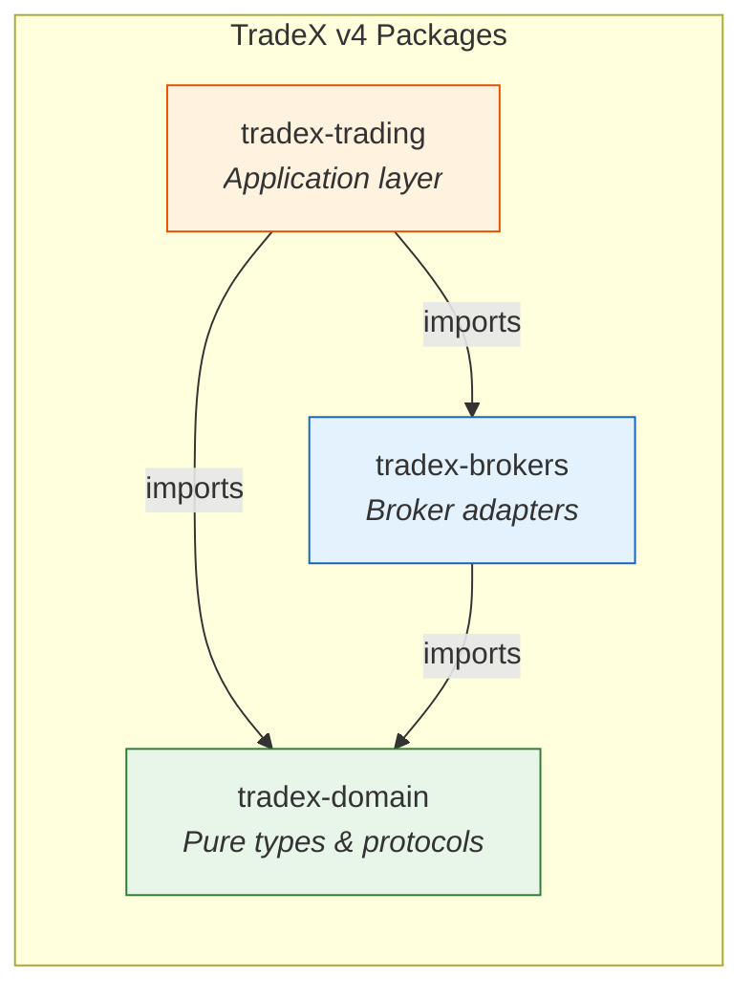

**Rule**: Dependencies flow strictly left-to-right. The `domain` package has **zero** imports from `brokers` or `trading`. The `brokers` package has **zero** imports from `trading`.

### 3.2 External Dependencies

| Dependency | Required | Used By | Purpose |
|-----------|----------|---------|---------|
| `tradex-domain` | Yes | All modules | Core types, protocols, value objects, events |
| `tradex-brokers` | Yes | `runtime/`, `sdk/` | Broker adapters, token management, master files |
| `rx` (RxPY ≥3.2, <4) | Yes | `reactive/`, `execution/`, `strategy/` | Reactive streams backbone |
| `numpy` ≥1.26 | Optional (`analytics`) | `analytics/` | Numerical computations |
| `duckdb` ≥0.10 | Optional (`datalake`) | `datalake/parquet_catalog.py` | Columnar data storage |
| `fastapi` ≥0.110 | Optional (`api`) | `interface/fastapi_app.py` | HTTP API framework |
| `uvicorn` ≥0.29 | Optional (`api`) | `interface/cli.py` (via `serve`) | ASGI server |
| `httpx2` ≥2.0 | Optional (`api`) | `interface/fastapi_app.py` | Async HTTP client |

### 3.3 Internal Module Dependency Map

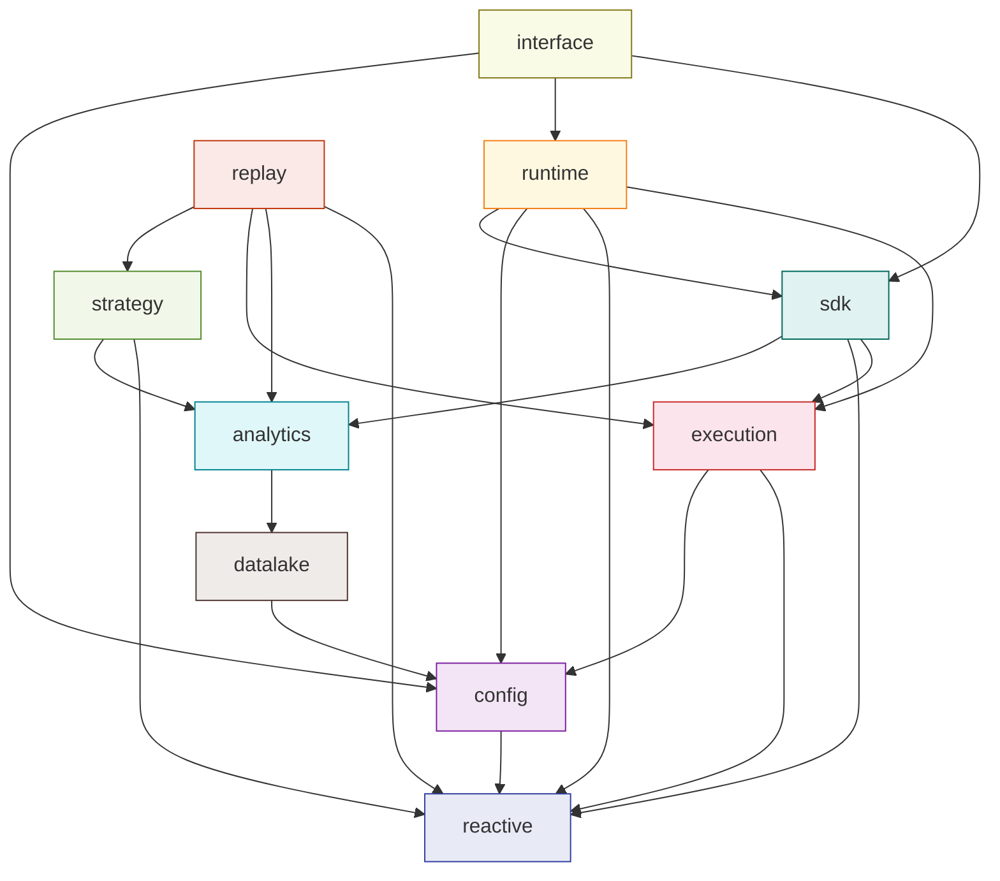

### 3.4 Dependency Rule Enforcement

- **Import cycles**: Zero — verified by graphify analysis (8,499 nodes / 25,111 edges)
- **Layer violations**: `domain` never imports from `brokers` or `trading`; `brokers` never imports from `trading`
- **Optional isolation**: FastAPI/uvicorn are lazily imported only by `tradex serve` CLI command, keeping the base package importable without the `api` extra


---

## 4. Module Architecture

### 4.1 `config/` — Configuration Schema

**Responsibility**: Define the immutable configuration tree, load from environment variables, and parse YAML/JSON config files.

**Files**:
| File | Lines | Responsibility |
|------|-------|---------------|
| `schema.py` | 198 | Frozen dataclass configuration tree with strict validation |
| `env.py` | 127 | Environment variable → `AppConfig` mapping; `.env` file loader |
| `loader.py` | 126 | JSON/YAML file → `AppConfig` parsing |

**Configuration Tree**:

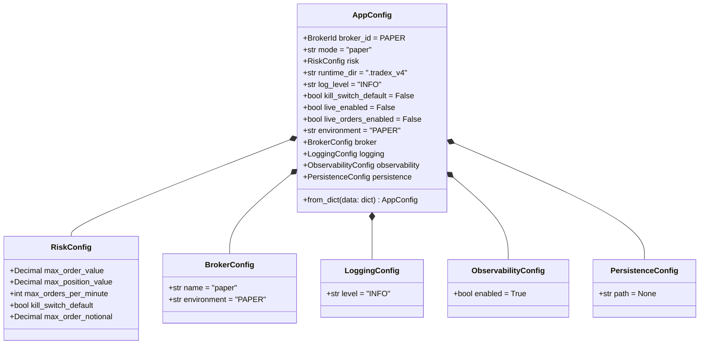

**Key Design Decisions**:
- All config dataclasses are **frozen** (`frozen=True, slots=True`) — immutable after construction
- **Strict validation**: `AppConfig.from_dict()` rejects unknown keys with `ValueError`
- **Decimal coercion**: `RiskConfig.__post_init__` converts `float`/`int` to `Decimal` for financial precision
- **Opt-in env file**: `load_env_file()` is explicit — `boot()` never auto-discovers credential files
- **YAML optional**: `load_yaml()` returns `{}` if PyYAML is not installed (graceful degradation)

---

### 4.2 `reactive/` — Reactive Infrastructure

**Responsibility**: Provide the RxPY-backed message bus, typed stream operators, backpressure presets, and subscription lifecycle management that form the nervous system of the entire platform.

**Files**:
| File | Lines | Responsibility |
|------|-------|---------------|
| `bus.py` | 127 | `ReactiveBus` — Subject-backed message bus with typed streams |
| `thread_safe_bus.py` | 71 | `ThreadSafeBus` — cross-thread safe wrapper |
| `bounded_bus.py` | 92 | `BoundedBus` — backpressure-bounded bus variant |
| `operators.py` | 71 | RxPY operator library (12 operators) |
| `backpressure.py` | 46 | `BackpressurePresets` — preconfigured strategies |
| `subscription.py` | 72 | `SubscriptionManager`, `DisposableSubscription` |
| `async_dispatch.py` | 85 | Bridge RxPY subscriptions to asyncio coroutines |
| `message_log.py` | 114 | Ordered message recording for replay/debugging |

**Core Class — `ReactiveBus`**:

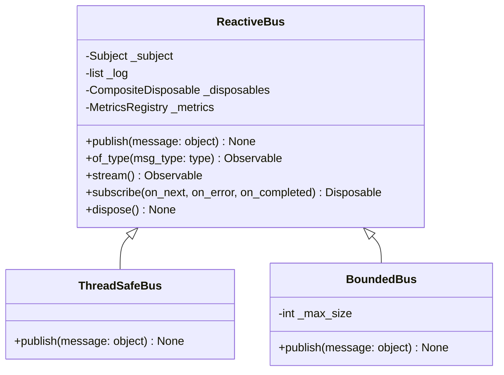

**Key Behaviors**:
- **`publish(message)`**: Pushes to all subscribers via `Subject.on_next()`; logs to optional message log; increments metrics counter; catches and logs subscriber exceptions (error isolation)
- **`of_type(msg_type)`**: Returns a typed `Observable` stream filtered to messages of the given type, auto-shared
- **`subscribe(on_next)`**: Wraps the handler with error isolation — a raising subscriber is logged without affecting others
- **`dispose()`**: Disposes all tracked subscriptions via `CompositeDisposable`

**Operator Library** (`operators.py`):

| Operator | Description |
|----------|-------------|
| `of_type(cls)` | Filter to messages of a specific type |
| `share()` | Multicast observable to multiple subscribers |
| `replay_buffer(n)` | Replay last *n* items to new subscribers |
| `throttle_first(window)` | Emit first item, ignore rest within time window |
| `sample(window)` | Emit most recent item at regular intervals |
| `distinct_until_changed()` | Suppress consecutive duplicate values |
| `take_until(signal)` | Complete when signal observable emits |
| `map_to(value)` | Map every emission to a constant value |
| `filter_safe(predicate)` | Filter with exception safety |
| `catch_error(handler)` | Catch and handle stream errors |

---

### 4.3 `execution/` — Execution Engine & OMS

**Responsibility**: The reactive order execution pipeline — the core of v4. Transforms `OrderRequest` / `PlaceOrderCommand` into fills through a deterministic pipeline: idempotency → kill switch → risk → fill → OMS update → event publication.

**Files**:
| File | Lines | Responsibility |
|------|-------|---------------|
| `engine.py` | 589 | `ExecutionEngine`, `RiskManager`, `IdempotencyGuard` |
| `order_manager.py` | 98 | `OrderManager` — order lifecycle FSM |
| `position_manager.py` | 101 | `PositionManager` — WAP position tracking |
| `fill_sources.py` | 239 | `FillSource` protocol + 4 implementations |
| `fees.py` | 197 | `FeeCalculator`, `PricingService` — Indian equity fee math |
| `slippage.py` | 98 | `SlippageModel` protocol + 3 implementations |
| `reconciliation.py` | 269 | `ReconciliationEngine` — drift detection |
| `trading_cache.py` | 116 | `TradingCache` — in-memory order/position/quote cache |
| `sqlite_store.py` | 232 | `SQLiteOrderStore`, `SQLiteIdempotencyGuard` |
| `submission_safety.py` | 32 | Boundary-crossing detection |
| `thread_safe_cache.py` | 106 | Thread-safe cache wrapper |

#### Reactive Execution Pipeline

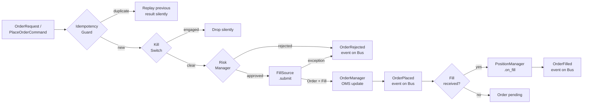

**Key Protocols**:

| Protocol | Methods | Implementations |
|----------|---------|----------------|
| `FillSource` | `submit(request) → (Order, Fill\|None)`, `cancel(order_id)` | `PaperFillSource`, `SimulatedFillSource`, `BrokerFillSource`, `ReplayFillSource` |
| `OrderStore` | `upsert(order)`, `get(order_id)`, `all_orders()` | `InMemoryOrderStore`, `SQLiteOrderStore` |
| `IdempotencyGuard` | `check_and_reserve(cid)`, `record_result(cid, result)`, `release(cid)` | `MemoryIdempotencyGuard`, `SQLiteIdempotencyGuard` |

**`ExecutionEngine`** — The Order Spine:
- Subscribes to `OrderRequest` and `PlaceOrderCommand` on the `ReactiveBus`
- Pipeline: idempotency check → kill switch → risk check → fill → OMS update → publish events
- `submit(request)` — synchronous bridge that calls the pipeline directly
- `shutdown()` — sets kill switch, disposes pipeline subscriptions
- Context manager support (`__enter__`/`__exit__`)

**`RiskManager`**:
- Master gate: `live_orders_enabled` — when `False`, all orders rejected
- Order value limit: `max_order_value` (price × quantity)
- Position value limit: `max_position_value`
- Rate limit: `max_orders_per_minute` (sliding 60-second window)
- Thread-safe via `threading.Lock`

**`OrderManager`** — Order Lifecycle FSM:
- `on_order_created` → cache as NEW
- `on_order_ack` → transition to ACK
- `on_order_filled` → transition to FILLED/PARTIALLY_FILLED, update `filled_quantity`
- `on_order_cancelled` → transition to CANCELLED
- `on_order_rejected` → transition to REJECTED
- `apply_unknown` → force-write for reconciliation

**`PositionManager`** — Position Tracking:
- Weighted average price (WAP) for entries
- Selling reduces position and books realized P&L
- Position flip support (long → short and vice versa)
- `reconcile_with_broker()` — delegates to `ReconciliationEngine`

**`FeeCalculator`** — Indian Equity Fee Math:
- STT: 0.1% delivery sell / 0.025% intraday sell
- Brokerage: 0.03% capped at ₹20/order
- Exchange: 0.00345% NSE transaction charges
- GST: 18% on (brokerage + exchange)
- All values quantized to 2dp (paisa) with `ROUND_HALF_UP`

**`ReconciliationEngine`** — Drift Detection:
- `reconcile(local, broker)` — position-level drift with severity classification
- `compare_orders(local, broker)` — order-level comparison
- `compare_funds(local, broker)` — funds/accounts comparison
- `DriftSeverity`: LOW → MEDIUM → HIGH → CRITICAL

---

### 4.4 `runtime/` — Boot, Health, Live Broker Construction

**Responsibility**: The composition root that wires all components together, live broker construction with credential gating, health monitoring, market data feed bridging, trading calendar, and metrics.

**Files**:
| File | Lines | Responsibility |
|------|-------|---------------|
| `startup.py` | 235 | `boot()`, `boot_context()` — composition root |
| `live.py` | 613 | Credential-gated live broker construction |
| `health.py` | 224 | Health check protocol + component checks |
| `market_feed.py` | 399 | Broker WebSocket → reactive bus bridge |
| `master_lifecycle.py` | 196 | Instrument master file download/cache |
| `calendar.py` | 100 | NSE/BSE trading calendar utilities |
| `metrics.py` | 135 | `MetricsRegistry` — counter/gauge/histogram |
| `session_states.py` | 46 | Session state constants |

#### Boot Sequence (`boot()`)

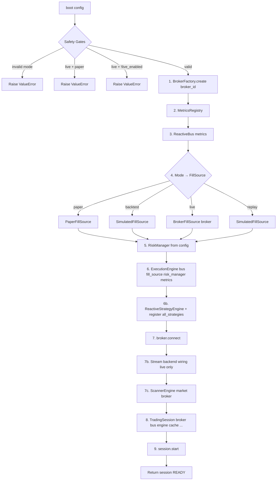

**`RuntimeContext`** bundles all components and provides `close()` for clean shutdown:
```
close() → session.stop() → engine.shutdown() → strategy_engine.dispose_all() → broker.close()
```

**Live Broker Construction** (`live.py`):
- **Credential-gated**: reads `os.environ` for broker credentials; raises `AuthenticationError` on missing values
- **Stdlib urllib**: default HTTP transport; `curl_cffi` preferred when installed (Cloudflare bypass)
- **Token management**: `DurableTokenManager` with file-backed state, `TotpCooldownGuard` for rate limiting
- **Master files**: downloads and caches instrument master files via `MasterLoader`/`MasterFileCache`
- **Secrets in memory only**: never written to disk except token state files in `runtime/`

**MarketFeed** — Live Tick Bridge:
- Subscribes broker WebSocket handlers for quotes and depth
- Publishes `Quote`/`Depth` onto the session `ReactiveBus`
- `FeedRegistry`: refcounts instrument subscriptions across WebSocket clients
- Depth normalization: `off` / `20` / `30` — single source of truth shared with FastAPI `/ws/stream`
- Instrument cap enforcement from `BrokerCapabilities.max_stream_instruments`
- Auto-reconnect handled by broker backends (`AutoReconnectMixin`), not by the feed

**Health Check System**:

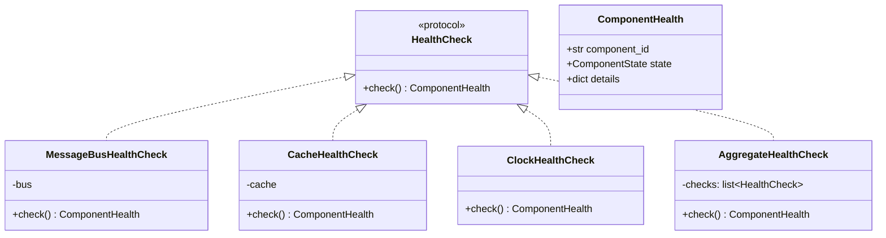

`ComponentState`: RUNNING → DEGRADED → ERROR (aggregate uses worst-state reporting)

**`MetricsRegistry`** — Stdlib-only metrics:
- `_Counter`: monotonically increasing (`inc()`)
- `_Gauge`: can go up and down (`set()`)
- `_Histogram`: cumulative with count/min/max/sum (`observe()`)
- Thread-safe, no external Prometheus dependency

**`NSETradingCalendar`**:
- Market hours: 09:15 – 15:30 IST, Monday–Friday
- `is_trading_day()`, `next_trading_day()`, `is_market_open()`
- Does not yet account for exchange-specific holidays

---

### 4.5 `sdk/` — Session & Services

**Responsibility**: The main user-facing entry point (`TradingSession`) with 7 capability-gated service classes that provide the complete trading API.

**Files**:
| File | Lines | Responsibility |
|------|-------|---------------|
| `session.py` | 494 | `TradingSession` — main entry point |
| `async_session.py` | 281 | `AsyncTradingSession` — async wrapper |
| `streaming.py` | 77 | `StreamSubscription`, `BackendStreamSubscription` |
| `protocols.py` | 45 | SDK-level protocol definitions |
| `session_manager.py` | — | `SessionManager` — multi-session lifecycle |
| `services/__init__.py` | 33 | Service re-exports |
| `services/_helpers.py` | 26 | `_as_order_id()`, `_broker_capabilities()` |
| `services/market.py` | 168 | `MarketService` — quotes, history, options, depth |
| `services/trade.py` | 114 | `TradeService` — order placement/mod/cancel |
| `services/portfolio.py` | 58 | `PortfolioService` — positions, holdings, funds |
| `services/stream.py` | 99 | `StreamService` — real-time streaming |
| `services/scanner.py` | 55 | `ScannerService` — market scanning |
| `services/analytics.py` | 46 | `AnalyticsService` — indicators, reports |
| `services/extension.py` | 209 | `ExtensionService` — kill switch, eDIS, TPIN |

#### TradingSession Lifecycle

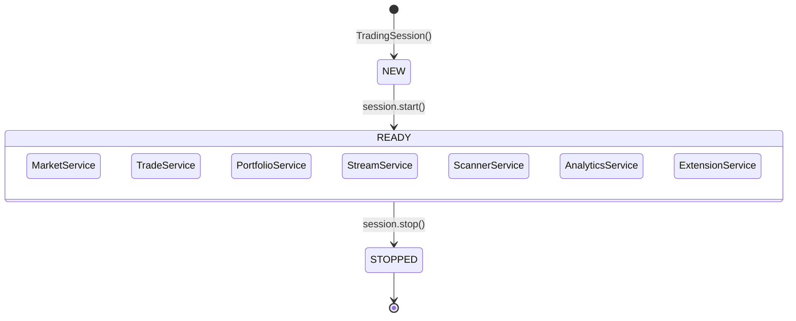

**Session State Rules**:
- `NEW`: Session created but not started; services unavailable
- `READY`: Session started, all 7 services accessible
- `STOPPED`: Session terminated; services raise `SessionStateError` if accessed
- Services raise `SessionStateError` if accessed outside `READY` state

#### Service Architecture

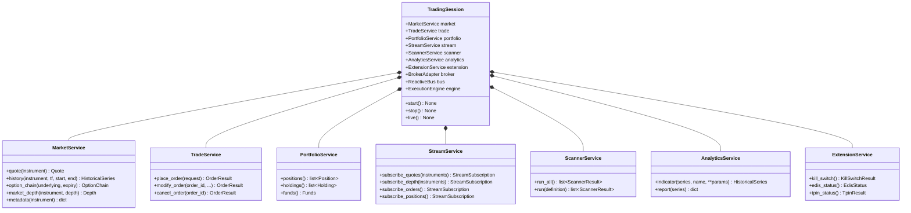

**Key Design Decisions**:
- **Capability-gated**: Each service checks `BrokerCapabilities` before exposing features; unsupported operations raise `CapabilityNotSupportedError`
- **Lazy FastAPI import**: The HTTP API (`fastapi_app.py`) is NOT imported by `sdk/` — it's lazily loaded by `tradex serve` to keep the base package lightweight
- **Stream subscriptions**: `StreamSubscription` wraps RxPY disposables; `BackendStreamSubscription` wraps broker WS backend IDs with thread-safe cancel
- **Async wrapper**: `AsyncTradingSession` provides `async/await` interface over the synchronous session


---

### 4.6 `strategy/` — Strategy Framework

**Responsibility**: Provide the reactive strategy engine, strategy protocol, scanner engine, ensemble coordination, and the auto-discovery mechanism for user-owned extensions.

**Files**:
| File | Lines | Responsibility |
|------|-------|---------------|
| `core/engine.py` | 117 | `ReactiveStrategyEngine` — strategy registration, Signal→Order bridge |
| `core/protocols.py` | 47 | `Strategy` protocol — the contract for all strategies |
| `core/scanner.py` | 118 | `ScannerEngine` — condition evaluation + ranking |
| `core/ensemble.py` | 255 | `StrategyEnsemble` — multi-strategy coordination |
| `core/buy_and_hold.py` | 61 | `BuyAndHoldStrategy` — reference implementation |
| `extensions/__init__.py` | 41 | Auto-discovery: `__all__` collection + `isinstance` filtering |
| `extensions/strategies/sma_cross.py` | 112 | SMA crossover strategy |
| `extensions/strategies/mean_reversion.py` | 139 | Mean reversion strategy |
| `extensions/scanners/momentum.py` | 26 | Momentum scanner definition |
| `extensions/scanners/pullback.py` | 31 | Pullback scanner definition |

#### Strategy Protocol

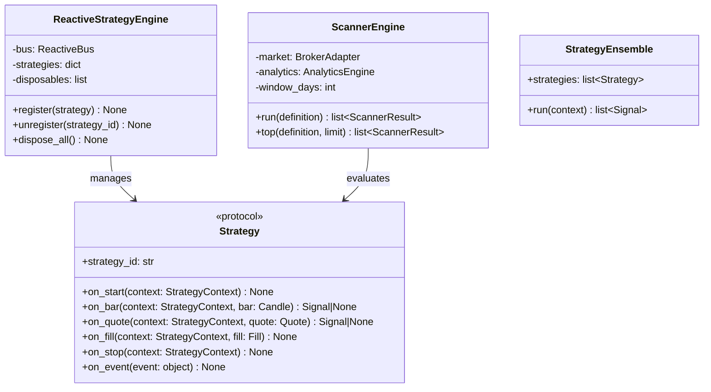

**`ReactiveStrategyEngine`** — Signal→Order Bridge:
1. Registers strategies and subscribes them to `Candle`/`Quote` streams on the bus
2. Wraps `on_bar`/`on_quote` to inject `StrategyContext` (bar_count, timestamp)
3. If a strategy returns a `Signal`, the engine automatically publishes a `PlaceOrderCommand` to the bus
4. The `PlaceOrderCommand` is picked up by the `ExecutionEngine` — closing the CQRS loop

**`ScannerEngine`** — Market Scanning:
- Accepts a `ScannerDefinition` (universe of instruments + conditions)
- For each instrument: fetches D1 history (30-day window), computes indicator values, evaluates conditions
- Returns ranked `ScannerResult` list sorted by score (matched conditions / total conditions)
- Uses `AnalyticsEngine` for indicator computation (SMA, EMA, RSI, etc.)

**Extension Auto-Discovery**:
```
strategy/extensions/
├── strategies/        # User strategies listed in __all__
├── scanners/          # User scanners listed in __all__
└── shared/            # Shared utilities
```
- Importing `strategy.extensions` triggers discovery
- `_collect(package, predicate)` iterates `__all__`, filters with `isinstance`
- Strategies must satisfy the `Strategy` protocol (`runtime_checkable`)
- Scanners must be `ScannerDefinition` dataclass instances
- Typos in `__all__` degrade gracefully — "not discovered" instead of import error

---

### 4.7 `analytics/` — Technical Indicators & Reports

**Responsibility**: Compute technical indicators, performance reports, and advanced analytics over market data.

**Files**:
| File | Lines | Responsibility |
|------|-------|---------------|
| `engine.py` | 330 | `AnalyticsEngine` — coordinates all analytics computations |
| `indicators.py` | 128 | SMA, EMA, RSI implementations |
| `reports.py` | 110 | Sharpe ratio, max drawdown, total return |
| `breadth.py` | 86 | Advance/decline market breadth |
| `volatility.py` | 21 | Realized volatility |
| `orderflow.py` | 14 | Order flow imbalance |
| `probability.py` | 13 | Win rate calculation |
| `futures.py` | 11 | Futures basis |
| `fundamentals.py` | 13 | P/E ratio |
| `sector.py` | 15 | Sector strength |
| `ranking.py` | 11 | Rank by return |
| `volume_profile.py` | 13 | Volume profile point of control |
| `options.py` | 39 | Black-Scholes call pricing, intrinsic value |
| `walk_forward.py` | 29 | Walk-forward window splitting |
| `warmup.py` | 67 | `WarmupFilter`, `warmup_indicator` |
| `feature_pipeline.py` | 93 | Feature engineering for ML pipelines |
| `functions.py` | 45 | Standalone analytics functions |

**`AnalyticsEngine`** — Central Coordinator:

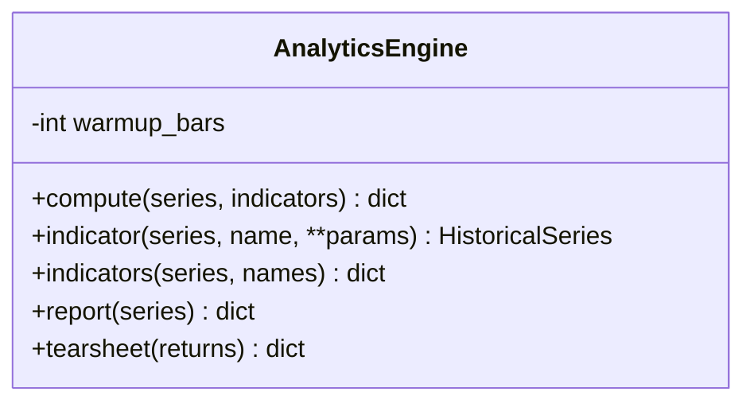

**Indicator Registry**:
| Indicator | Function | Default Period |
|-----------|----------|---------------|
| SMA | `sma(values, period)` | 20 |
| EMA | `ema(values, period)` | 20 |
| RSI | `rsi(values, period)` | 14 |

**Report Functions**:
| Report | Function | Description |
|--------|----------|-------------|
| Sharpe Ratio | `sharpe_ratio(returns)` | Risk-adjusted return |
| Max Drawdown | `max_drawdown(equity_curve)` | Peak-to-trough decline |
| Total Return | `total_return(equity_curve)` | Cumulative return |

**Advanced Analytics**:
- **Breadth**: `advance_decline(advances, declines)` — market participation
- **Volatility**: `realized_vol(returns, window)` — historical volatility
- **Order Flow**: `imbalance(bids, asks)` — buying vs selling pressure
- **Options**: `black_scholes_call(S, K, T, r, sigma)` — theoretical price
- **Volume Profile**: `poc(volumes, prices)` — point of control (highest volume price)
- **Warmup**: `WarmupFilter` strips initial None-padded values from indicator output

---

### 4.8 `datalake/` — Data Catalog & Quality

**Responsibility**: Persistent storage, quality validation, and unified access for market data — from JSON files to Parquet/DuckDB.

**Files**:
| File | Lines | Responsibility |
|------|-------|---------------|
| `catalog.py` | 260 | `DataCatalog` — file-backed OHLCV bar storage |
| `data_engine.py` | 62 | `DataEngine` — unified data access facade |
| `quality.py` | 141 | `DataQualityEngine` — data quality validation |
| `corporate_actions.py` | 156 | `CorporateAction`, `CorporateActionStore` |
| `parquet_catalog.py` | 94 | `ParquetCatalog` — columnar storage (DuckDB) |
| `source_selection.py` | 60 | `SourceSelectionPolicy` — live vs cached routing |
| `mcp_server.py` | 51 | `MCPDataLakeServer` — MCP protocol for AI agents |

**Data Storage Hierarchy**:

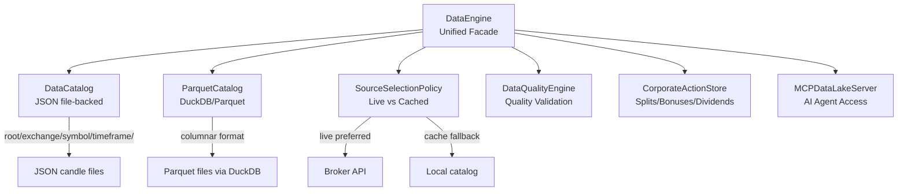

**`DataCatalog`** — File-backed storage:
- Directory structure: `root/{exchange}/{symbol}/{timeframe}/{YYYYMMDD_HHMMSS}.json`
- Each candle stored as JSON with ISO timestamp and string-encoded Decimal values
- `write_bar(instrument, timeframe, candle)` — creates directory structure automatically
- `read_bars(instrument, timeframe, start, end)` — reads and parses candles with date filtering

**`CorporateActionStore`**:
- Tracks splits, bonuses, dividends
- Adjusts historical prices for corporate actions
- Delisting ledger for removed instruments

**`SourceSelectionPolicy`**:
- `DataSourceKind`: enum for `LIVE`, `CACHE`, `HYBRID`
- Routes data requests to live broker API or local cache based on policy
- Supports freshness checking and fallback logic

---

### 4.9 `replay/` — Backtesting & Replay

**Responsibility**: Deterministic event replay through the reactive bus and strategy backtesting with fee-aware P&L tracking.

**Files**:
| File | Lines | Responsibility |
|------|-------|---------------|
| `engine.py` | 192 | `ReplayEngine` — historical event replay through bus |
| `backtest.py` | 265 | `BacktestEngine` — deterministic backtesting |
| `optimization.py` | 105 | Parameter optimization support |
| `walk_forward.py` | 189 | `WalkForwardOptimizer` — out-of-sample validation |

**`ReplayEngine`**:
- Accepts a sequence of historical events
- Strategy registration with direct callback invocation
- Replays events through the `ReactiveBus` and to registered strategies
- Returns `ReplayResult` with event count and metrics

**`BacktestEngine`**:

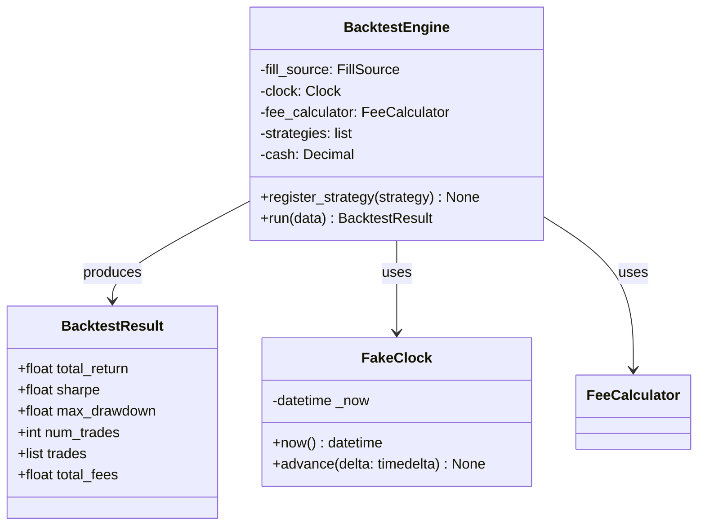

**Key Features**:
- **`FakeClock`**: Deterministic clock starting at a fixed instant, advanced per bar — no real time dependency
- **Fee-aware**: Optional `FeeCalculator` deducts fees from cash on each fill; `total_fees` surfaced in `BacktestResult`
- **Performance metrics**: `total_return`, `sharpe` ratio, `max_drawdown`, `num_trades`
- **Strategy protocol**: Same `Strategy` protocol as live — strategies work unchanged in backtest

**`WalkForwardOptimizer`**:
- Splits data into train/test windows
- Runs in-sample optimization on train, out-of-sample validation on test
- Prevents overfitting by ensuring strategies are validated on unseen data

---

### 4.10 `interface/` — CLI, HTTP API, TUI

**Responsibility**: All user-facing interfaces — command-line, HTTP REST API with WebSocket streaming, terminal UI, and connectivity probing.

**Files**:
| File | Lines | Responsibility |
|------|-------|---------------|
| `cli.py` | 417 | `main()` — argparse-based CLI (stdlib only) |
| `fastapi_app.py` | 1115 | FastAPI HTTP API — REST + WebSocket + CORS |
| `tui.py` | 118 | `TUI` — terminal user interface |
| `check_connection.py` | 184 | `check_connection()` — broker connectivity probe |

#### CLI Commands

| Command | Description |
|---------|-------------|
| `tradex quote {exchange} {symbol}` | Get quote for an instrument |
| `tradex order {exchange} {symbol} {side} {qty}` | Place an order |
| `tradex health` | Check system health |
| `tradex scanner` | Run market scanner |
| `tradex positions` | List all positions |
| `tradex account` | Show account info |
| `tradex orders` | List orders |
| `tradex watch {instrument}` | Watch live quotes |
| `tradex serve` | Start HTTP API (FastAPI + uvicorn) |

**CLI Options**:
- `--env-file`: Optional KEY=VALUE file (explicit opt-in)
- `--broker`: Broker selection (PAPER/DHAN/UPSTOX)
- `--mode`: Execution mode (paper/backtest/replay/live)

#### FastAPI HTTP API

**Architecture**:
- **CORS**: Enabled for cross-origin access
- **Auth**: API key header authentication
- **WebSocket**: `/ws/stream` endpoint for real-time data with bounded outbound queues
- **Backpressure**: `OUTBOUND_QUEUE_MAX=1024` for ticks, `CONTROL_QUEUE_MAX=256` for order events
- **Drop-oldest**: On queue overflow, oldest messages are dropped (ticks: oldest tick; control: oldest order event)
- **Single writer**: A writer task drains queues — producers never await the socket

**Outbound Queue Design**:

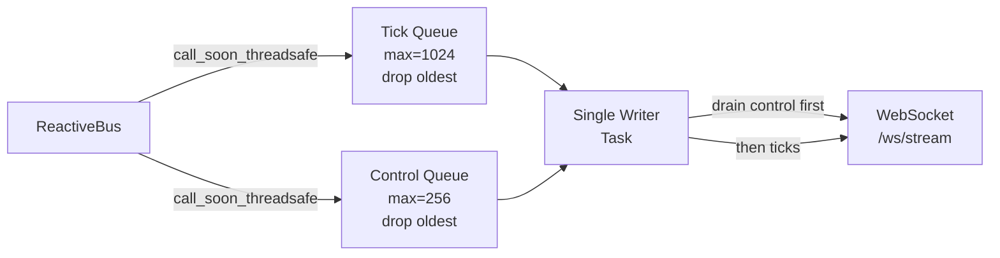

**Connection Probe** (`check_connection.py`):
- Verifies broker connectivity without placing orders
- Tests authentication, token validity, and basic API reachability
- Returns structured connection status


---

## 5. Component Diagrams

### 5.1 System Context Diagram

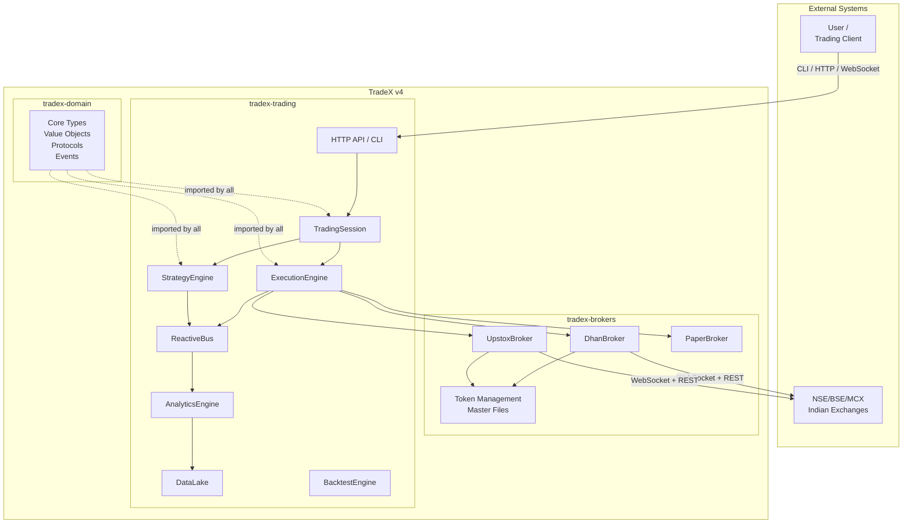

### 5.2 Container Diagram — Trading Package

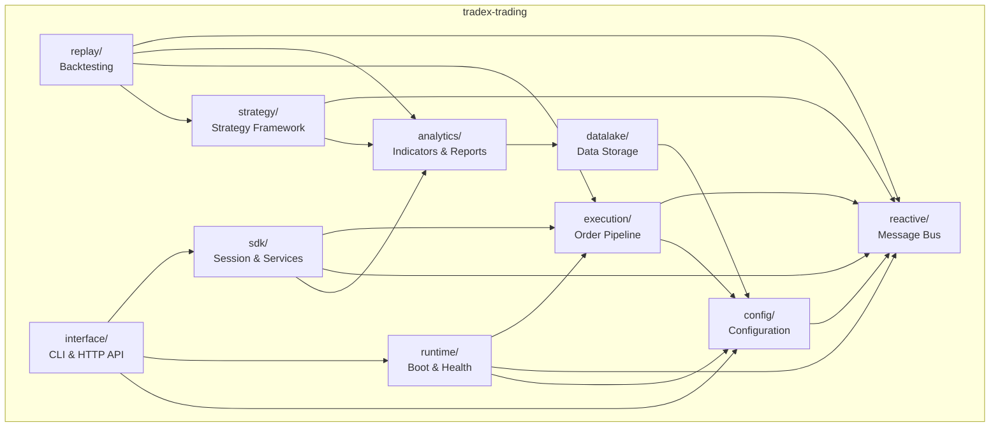

### 5.3 Execution Engine Component Diagram

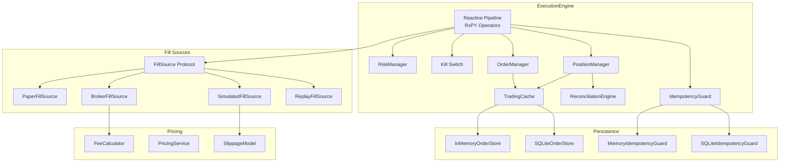

### 5.4 SDK Services Component Diagram

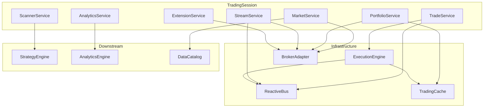

---

## 6. Data Flow Diagrams

### 6.1 Order Submission Flow

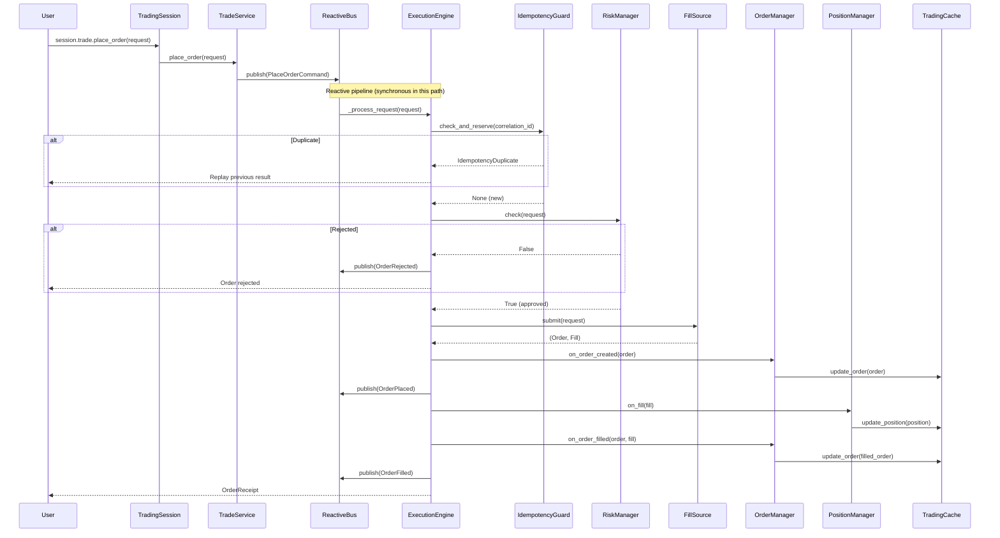

### 6.2 Market Data Flow (Live)

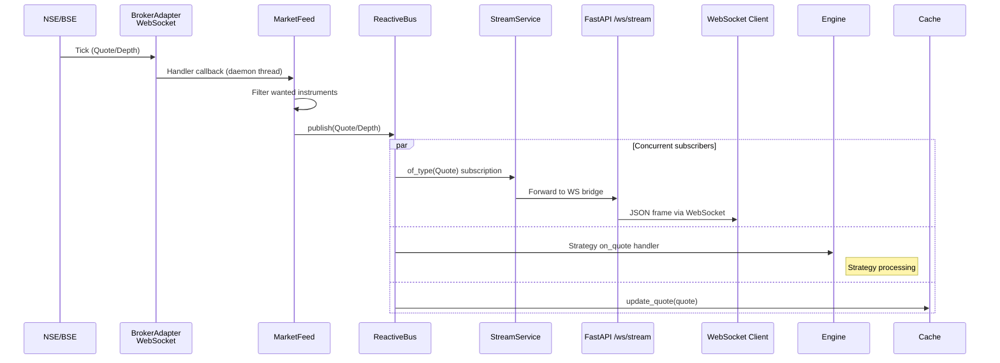

### 6.3 Strategy Signal→Order Flow

```mermaid
sequenceDiagram
    participant Bus as ReactiveBus
    participant RSE as ReactiveStrategyEngine
    participant Strategy as Strategy.on_bar()
    participant Engine as ExecutionEngine
    participant Fill as FillSource
    participant OM as OrderManager

    Bus->>RSE: Candle event (of_type stream)
    RSE->>RSE: _wrap_on_bar(strategy)
    RSE->>RSE: _make_context(bar_count, timestamp)
    RSE->>Strategy: on_bar(context, candle)
    Strategy-->>RSE: Signal(direction, strength, instrument)

    RSE->>RSE: _maybe_publish_order(signal)
    RSE->>Bus: publish(PlaceOrderCommand)

    Bus->>Engine: of_type(PlaceOrderCommand) subscription
    Engine->>Engine: _process_request(cmd.request)
    Engine->>Fill: submit(request)
    Fill-->>Engine: (Order, Fill)
    Engine->>OM: on_order_created + on_order_filled
    Engine->>Bus: publish(OrderPlaced, OrderFilled)

    Bus->>RSE: OrderFilled event
    RSE->>Strategy: on_fill(context, fill)
```

### 6.4 Boot Sequence Flow

```mermaid
sequenceDiagram
    participant CLI as CLI / API
    participant Boot as boot()
    participant Factory as BrokerFactory
    participant Bus as ReactiveBus
    participant Engine as ExecutionEngine
    participant Strat as ReactiveStrategyEngine
    participant Broker as BrokerAdapter
    participant Session as TradingSession

    CLI->>Boot: boot(config)
    Boot->>Boot: Safety gates (mode, live_enabled)
    Boot->>Factory: create(broker_id)
    Factory-->>Boot: broker instance
    Boot->>Bus: ReactiveBus(metrics)
    Boot->>Boot: Select FillSource by mode
    Boot->>Engine: ExecutionEngine(bus, fill, risk, metrics)
    Boot->>Strat: ReactiveStrategyEngine(bus)

    loop For each discovered strategy
        Boot->>Strat: register(strategy)
        Strat->>Bus: Subscribe to Candle/Quote streams
    end

    Boot->>Broker: connect()
    Boot->>Broker: stream_backend() (live only)
    Boot->>Session: TradingSession(broker, bus, engine, ...)
    Boot->>Session: start()
    Session-->>Boot: session (READY)
    Boot-->>CLI: TradingSession
```

### 6.5 Backtest Flow

```mermaid
sequenceDiagram
    participant User
    participant BT as BacktestEngine
    participant Clock as FakeClock
    participant Data as Historical Data
    participant Strategy as Strategy
    participant Fill as SimulatedFillSource
    participant Fees as FeeCalculator

    User->>BT: BacktestEngine(fee_calculator=Fees)
    User->>BT: register_strategy(strategy)
    User->>BT: run(data)

    loop For each bar in data
        BT->>Clock: advance(timedelta)
        BT->>Data: Get next candle
        BT->>Strategy: on_bar(context, candle)
        Strategy-->>BT: Signal | None

        alt Signal returned
            BT->>Fill: submit(order_request)
            Fill-->>BT: (Order, Fill)
            BT->>Fees: calculate(fill)
            Fees-->>BT: FeeBreakdown
            BT->>BT: Deduct fees from cash
        end
    end

    BT->>BT: Compute total_return, sharpe, max_drawdown
    BT-->>User: BacktestResult
```

---

## 7. Runtime Lifecycle

### 7.1 Session State Machine

```mermaid
stateDiagram-v2
    [*] --> NEW

    NEW --> READY : session.start()
    note right of READY
        All 7 services available:
        market, trade, portfolio,
        stream, scanner, analytics,
        extension
    end note

    READY --> STOPPED : session.stop()
    note right of STOPPED
        All services raise
        SessionStateError
        if accessed
    end note

    STOPPED --> [*]

    NEW --> STOPPED : error during start
```

### 7.2 Boot Composition Root

The `boot()` function in `runtime/startup.py` is the **ONLY** place that wires all components together. It follows a strict 9-step sequence:

| Step | Action | Failure Behavior |
|------|--------|-----------------|
| 0 | Safety gates (mode validation, live_enabled check) | Raise `ValueError` immediately |
| 1 | `BrokerFactory.create(broker_id)` | Raise if broker creation fails |
| 2 | `MetricsRegistry()` | Never fails |
| 3 | `ReactiveBus(metrics=metrics)` | Never fails |
| 4 | Select `FillSource` by mode | Raise on unknown mode |
| 5 | `RiskManager` from config | Never fails |
| 6 | `ExecutionEngine(bus, fill, risk, metrics)` | Raise if pipeline setup fails |
| 6b | `ReactiveStrategyEngine` + register all strategies | Raise if registration fails |
| 7 | `broker.connect()` | Raise if connection fails |
| 7b | Stream backend wiring (live only) | Log warning, degrade gracefully |
| 7c | `ScannerEngine(market=broker)` | Never fails |
| 8 | `TradingSession(broker, bus, engine, cache, ...)` | Raise if session creation fails |
| 9 | `session.start()` | Raise if start fails |

**Fail-closed**: Any error at any step prevents session creation. No partial initialization is ever returned.

### 7.3 Shutdown Sequence

```mermaid
flowchart TD
    CLOSE[RuntimeContext.close] --> STOP[session.stop]
    STOP --> SD[engine.shutdown]
    SD --> KS[Set kill switch]
    KS --> DISP[Dispose pipeline subscriptions]
    DISP --> SDISP[Dispose command subscription]
    SDISP --> STRAT[strategy_engine.dispose_all]
    STRAT --> BRK[broker.close]
    BRK --> DONE[All resources released]

    style CLOSE fill:#ffcdd2,stroke:#c62828
    style DONE fill:#c8e6c9,stroke:#2e7d32
```

**Shutdown guarantees**:
- Each step is wrapped in try/except — errors in one component don't prevent others from shutting down
- Kill switch is set first — no new orders accepted during shutdown
- Pipeline disposables are cleaned up — no dangling RxPY subscriptions
- Broker WebSocket sockets are owned by the broker and torn down by `broker.close()`

### 7.4 Kill Switch Semantics

The kill switch is a `threading.Event` on the `ExecutionEngine`:
- **Engaged**: All incoming `OrderRequest`/`PlaceOrderCommand` are silently dropped
- **Pipeline filter**: The RxPY pipeline filters out requests when kill switch is set
- **Synchronous submit**: Also checks kill switch before processing
- **Toggle**: `engine.kill_switch = True/False` (controlled via `ExtensionService`)

### 7.5 Health Check Aggregation

```mermaid
flowchart LR
    subgraph "Component Checks"
        MB[MessageBusHealthCheck]
        CH[CacheHealthCheck]
        CK[ClockHealthCheck]
    end

    subgraph "Aggregate"
        AGG[AggregateHealthCheck]
    end

    MB -->|ComponentHealth| AGG
    CH -->|ComponentHealth| AGG
    CK -->|ComponentHealth| AGG

    AGG -->|Worst state wins| RESULT[Overall HealthStatus]

    style RESULT fill:#c8e6c9,stroke:#2e7d32
```

**Severity ordering**: ERROR > STOPPING > DEGRADED > STARTING > RUNNING

The aggregate reports the **worst** component state as the overall health status. Individual component details are preserved in the response for diagnostics.

---

## 8. Configuration Reference

### 8.1 Full `AppConfig` Schema

| Field | Type | Default | Description |
|-------|------|---------|-------------|
| `broker_id` | `BrokerId` | `PAPER` | Broker identity: `PAPER`, `DHAN`, `UPSTOX`, `REPLAY` |
| `mode` | `str` | `"paper"` | Execution mode: `paper`, `backtest`, `replay`, `live` |
| `risk` | `RiskConfig` | *(defaults)* | Risk management configuration |
| `runtime_dir` | `str` | `".tradex_v4"` | Directory for runtime data (logs, cache) |
| `log_level` | `str` | `"INFO"` | Logging level |
| `kill_switch_default` | `bool` | `False` | Default state of the kill switch on boot |
| `live_enabled` | `bool` | `False` | Master gate: must be `True` for live mode |
| `live_orders_enabled` | `bool` | `False` | Order placement gate for live trading |
| `environment` | `str` | `"PAPER"` | Runtime environment: `PAPER`, `SANDBOX`, `LIVE` |
| `broker` | `BrokerConfig` | *(defaults)* | Broker connection configuration |
| `logging` | `LoggingConfig` | *(defaults)* | Logging configuration |
| `observability` | `ObservabilityConfig` | *(defaults)* | Observability (metrics/tracing) configuration |
| `persistence` | `PersistenceConfig` | *(defaults)* | Optional SQLite durability configuration |

### 8.2 `RiskConfig` Fields

| Field | Type | Default | Description |
|-------|------|---------|-------------|
| `max_order_value` | `Decimal \| None` | `None` | Maximum order value (price × quantity) |
| `max_position_value` | `Decimal \| None` | `None` | Maximum total position value |
| `max_orders_per_minute` | `int \| None` | `None` | Rate limit: max orders per 60-second window |
| `kill_switch_default` | `bool` | `False` | Kill switch initial state |
| `max_order_notional` | `Decimal \| None` | `None` | Max order notional (v3 compatibility) |

### 8.3 `BrokerConfig` Fields

| Field | Type | Default | Description |
|-------|------|---------|-------------|
| `name` | `str` | `"paper"` | Broker name |
| `environment` | `str` | `"PAPER"` | Broker environment |

### 8.4 `PersistenceConfig` Fields

| Field | Type | Default | Description |
|-------|------|---------|-------------|
| `path` | `str \| None` | `None` | SQLite database path; `None` = in-memory only |

### 8.5 Environment Variable Mapping

| Environment Variable | AppConfig Field | Example |
|---------------------|-----------------|---------|
| `TRADEX_BROKER` | `broker_id` | `DHAN` |
| `TRADEX_MODE` | `mode` | `live` |
| `TRADEX_RUNTIME_DIR` | `runtime_dir` | `/var/tradex/runtime` |
| `TRADEX_LOG_LEVEL` | `log_level` | `DEBUG` |
| `TRADEX_KILL_SWITCH` | `kill_switch_default` | `true` |
| `TRADEX_RISK_MAX_ORDER_VALUE` | `risk.max_order_value` | `100000` |
| `TRADEX_RISK_MAX_POSITION_VALUE` | `risk.max_position_value` | `500000` |
| `TRADEX_RISK_MAX_ORDERS_PER_MINUTE` | `risk.max_orders_per_minute` | `60` |
| `TRADEX_RISK_MAX_ORDER_NOTIONAL` | `risk.max_order_notional` | `100000` |
| `TRADEX_BROKER_NAME` | `broker.name` | `dhan` |
| `TRADEX_BROKER_ENVIRONMENT` | `broker.environment` | `LIVE` |

### 8.6 YAML Config Example

```yaml
broker_id: DHAN
mode: live
live_enabled: true
live_orders_enabled: true
environment: LIVE
runtime_dir: /var/tradex/runtime
log_level: INFO
kill_switch_default: false

broker:
  name: dhan
  environment: LIVE

risk:
  max_order_value: "100000"
  max_position_value: "500000"
  max_orders_per_minute: 60

logging:
  level: INFO

observability:
  enabled: true

persistence:
  path: /var/tradex/data/orders.db
```

### 8.7 Mode Matrix

| Mode | FillSource | Broker | Live Network | Persistence | Strategy |
|------|-----------|--------|-------------|-------------|----------|
| `paper` | `PaperFillSource` | `PaperBroker` | No | Optional | Supported |
| `backtest` | `SimulatedFillSource` | Injected | No | Optional | Supported |
| `replay` | `SimulatedFillSource` | Injected | No | Optional | Supported |
| `live` | `BrokerFillSource` | `DhanBroker` / `UpstoxBroker` | Yes | Optional | Supported |

**Constraints**:
- `live` mode requires `broker_id != PAPER`
- `live` mode requires `live_enabled = true`
- `live` mode triggers credential loading from environment variables

---

## 9. Extension Contract

### 9.1 Adding a New Strategy

**Step 1**: Create a strategy class implementing the `Strategy` protocol:

```python
# trading/src/tradex_trading/strategy/extensions/strategies/my_strategy.py

from tradex_domain.market import Candle, Quote
from tradex_domain.execution import Fill
from tradex_domain.strategy import Signal, StrategyContext

class MyStrategy:
    """Custom trading strategy."""

    @property
    def strategy_id(self) -> str:
        return "my_strategy_v1"

    def on_start(self, context: StrategyContext) -> None:
        """Initialize state when strategy starts."""
        self._bars_seen = 0

    def on_bar(self, context: StrategyContext, bar: Candle) -> Signal | None:
        """Called on each new bar. Return a Signal to trigger an order."""
        self._bars_seen += 1
        if self._bars_seen > 20:
            return Signal(
                instrument=bar.instrument,
                direction="BUY",
                strength=1.0,
            )
        return None

    def on_quote(self, context: StrategyContext, quote: Quote) -> Signal | None:
        """Called on each new quote. Return None to ignore."""
        return None

    def on_fill(self, context: StrategyContext, fill: Fill) -> None:
        """Called when an order is filled."""
        pass

    def on_stop(self, context: StrategyContext) -> None:
        """Cleanup when strategy stops."""
        pass

    def on_event(self, event: object) -> None:
        """Handle generic events."""
        pass
```

**Step 2**: Register it in the strategies `__init__.py`:

```python
# trading/src/tradex_trading/strategy/extensions/strategies/__init__.py

from tradex_trading.strategy.extensions.strategies.my_strategy import MyStrategy

__all__ = ["SMACrossStrategy", "MeanReversionStrategy", "MyStrategy"]
```

**Step 3**: That's it. The auto-discovery mechanism will:
1. Import `strategies` package on next boot
2. Iterate `__all__` entries
3. Check `isinstance(obj, Strategy)` (runtime-checkable protocol)
4. Register matching objects into `ReactiveStrategyEngine`

### 9.2 Adding a New Scanner

**Step 1**: Create a `ScannerDefinition`:

```python
# trading/src/tradex_trading/strategy/extensions/scanners/my_scanner.py

from tradex_domain.strategy import ScannerDefinition, Condition
from tradex_domain.enums import Timeframe

# Define the scanner
MomentumScanner = ScannerDefinition(
    name="momentum_scanner",
    universe=[...],  # List of instruments to scan
    conditions=[
        Condition(name="rsi", operator=">", threshold=70, params={"period": 14}),
        Condition(name="sma", operator=">", threshold=0, params={"period": 20}),
    ],
    timeframe=Timeframe.D1,
)
```

**Step 2**: Register in scanners `__init__.py`:

```python
# trading/src/tradex_trading/strategy/extensions/scanners/__init__.py

from tradex_trading.strategy.extensions.scanners.my_scanner import MomentumScanner as MyScanner

__all__ = ["MomentumScanner", "PullbackScanner", "MyScanner"]
```

The auto-discovery filters `ScannerDefinition` instances via `isinstance` and exposes them through `all_scanners`.

### 9.3 Auto-Discovery Mechanism

```mermaid
flowchart TD
    IMPORT[Import strategy.extensions] --> COLLECT_S[Collect from strategies package]
    IMPORT --> COLLECT_SC[Collect from scanners package]

    COLLECT_S --> ITER_S[Iterate __all__]
    ITER_S --> CHECK_S{isinstance obj<br/>Strategy protocol?}
    CHECK_S -->|yes| ADD_S[Add to all_strategies]
    CHECK_S -->|no| SKIP_S[Skip]

    COLLECT_SC --> ITER_SC[Iterate __all__]
    ITER_SC --> CHECK_SC{isinstance obj<br/>ScannerDefinition?}
    CHECK_SC -->|yes| ADD_SC[Add to all_scanners]
    CHECK_SC -->|no| SKIP_SC[Skip]

    ADD_S --> BOOT[boot registers into<br/>ReactiveStrategyEngine]
    ADD_SC --> BOOT2[boot binds into<br/>ScannerService]
```

**Key properties**:
- **Zero-touch**: No registration code needed beyond adding to `__all__`
- **Graceful degradation**: Missing names in `__all__` are silently skipped
- **Type-safe**: `isinstance` check against `runtime_checkable` Protocol
- **Core untouched**: User code lives entirely in `extensions/`; core framework is never modified

---

## 10. Test Organization

### 10.1 Test Directory Structure

```
trading/tests/
├── analytics/          →  src/tradex_trading/analytics/
├── contracts/          →  Cross-module integration contracts
├── datalake/           →  src/tradex_trading/datalake/
├── execution/          →  src/tradex_trading/execution/
├── integration/        →  Full-stack integration tests
├── interface/          →  src/tradex_trading/interface/
├── parity/             →  Cross-provider (Dhan/Upstox) parity
├── reactive/           →  src/tradex_trading/reactive/
├── replay/             →  src/tradex_trading/replay/
└── runtime/            →  src/tradex_trading/runtime/
```

### 10.2 Test Categories

| Category | Directory | Description | Count |
|----------|-----------|-------------|-------|
| **Unit** | `analytics/`, `execution/`, `reactive/`, `replay/`, `runtime/`, `datalake/` | Test individual modules in isolation | ~90 files |
| **Contract** | `contracts/` | Cross-module integration contracts (adapter protocol, domain types, CQRS bridge) | 11 files |
| **Integration** | `integration/` | Full-stack wiring tests (boot, extensions, end-to-end) | 3 files |
| **Interface** | `interface/` | FastAPI endpoint tests, CLI/TUI module tests | 3 files |
| **Parity** | `parity/` | Cross-provider behavior parity (Dhan ↔ Upstox) | 2 files |
| **Gap Analysis** | `*_gaps.py`, `*_edges.py` | Edge case and missing coverage tests | ~20 files |
| **v3 Port** | `*_v3_port.py` | Backward compatibility with v3 API surface | ~6 files |

### 10.3 Test Counts by Module

| Module | Test Files | Approximate Tests |
|--------|-----------|-------------------|
| `analytics/` | 9 | ~50 |
| `contracts/` | 11 | ~60 |
| `datalake/` | 10 | ~55 |
| `execution/` | 32 | ~180 |
| `integration/` | 3 | ~15 |
| `interface/` | 3 | ~40 |
| `parity/` | 2 | ~15 |
| `reactive/` | 8 | ~50 |
| `replay/` | 7 | ~40 |
| `runtime/` | 16 | ~90 |
| **Total** | **~101** | **~600+** |

### 10.4 Test Naming Conventions

| Pattern | Purpose |
|---------|---------|
| `test_*.py` | Standard unit tests |
| `test_*_gaps.py` | Gap analysis — covering previously missing scenarios |
| `test_*_edges.py` | Edge case coverage |
| `test_*_v3_port.py` | v3 backward compatibility verification |
| `test_*_regression.py` | Regression tests for specific bug fixes |

### 10.5 Running Tests

```bash
# All trading tests
cd trading && uv run pytest tests/

# Specific module
cd trading && uv run pytest tests/execution/

# With coverage
cd trading && uv run pytest tests/ --cov=tradex_trading

# Type checking
cd trading && uv run mypy src/
```

---

## Appendix A: Key Protocols Summary

| Protocol | Package | Purpose | Implementations |
|----------|---------|---------|----------------|
| `BrokerAdapter` | `tradex-domain` | Broker operations contract | `DhanBroker`, `UpstoxBroker`, `PaperBroker` |
| `FillSource` | `execution` | Order fill abstraction | `PaperFillSource`, `SimulatedFillSource`, `BrokerFillSource`, `ReplayFillSource` |
| `OrderStore` | `execution` | Order persistence | `InMemoryOrderStore`, `SQLiteOrderStore` |
| `IdempotencyGuard` | `execution` | Duplicate request detection | `MemoryIdempotencyGuard`, `SQLiteIdempotencyGuard` |
| `Strategy` | `strategy` | Strategy contract | `BuyAndHoldStrategy`, `SMACrossStrategy`, `MeanReversionStrategy`, user strategies |
| `HealthCheck` | `runtime` | Component health | `MessageBusHealthCheck`, `CacheHealthCheck`, `ClockHealthCheck` |
| `SlippageModel` | `execution` | Slippage simulation | `FixedSlippageModel`, `PercentageSlippageModel`, `NoSlippageModel` |
| `Clock` | `tradex-domain` | Time abstraction | `FakeClock` (backtest), system clock (live) |
| `IndicatorComputer` | `tradex-domain` | Indicator computation | `AnalyticsEngine` |
| `TradingCacheProtocol` | `tradex-domain` | Cache contract | `TradingCache` |

## Appendix B: Event Types on the ReactiveBus

| Event | Source | Consumers |
|-------|--------|-----------|
| `PlaceOrderCommand` | `ReactiveStrategyEngine`, `TradeService` | `ExecutionEngine` |
| `OrderRequest` | Direct API calls | `ExecutionEngine` |
| `OrderPlaced` | `ExecutionEngine` | `StreamService`, `MessageLog` |
| `OrderFilled` | `ExecutionEngine` | `StreamService`, `ReactiveStrategyEngine`, `PositionManager` |
| `OrderRejected` | `ExecutionEngine` | `StreamService`, `MessageLog` |
| `ErrorOccurred` | `ExecutionEngine` (pipeline failures) | `MessageLog` |
| `Quote` | `MarketFeed` | `StreamService`, `TradingCache`, strategies |
| `Depth` | `MarketFeed` | `StreamService` |
| `Candle` | Historical data / bar aggregation | `ReactiveStrategyEngine`, `ScannerEngine` |

## Appendix C: Glossary

| Term | Definition |
|------|-----------|
| **Bus** | `ReactiveBus` — the central RxPY Subject-backed message bus |
| **Boot** | `boot()` — the composition root that wires all components |
| **CQRS** | Command Query Responsibility Segregation — strategies publish `PlaceOrderCommand`, engine processes |
| **Fill Source** | `FillSource` protocol — the seam between execution modes |
| **Kill Switch** | `threading.Event` that silently drops all incoming orders when engaged |
| **WAP** | Weighted Average Price — used by `PositionManager` for entries |
| **OMS** | Order Management System — `OrderManager` + `PositionManager` + `TradingCache` |
| **FeedRegistry** | Refcounts instrument subscriptions across WebSocket clients |
| **Signal→Order bridge** | `ReactiveStrategyEngine._maybe_publish_order()` — auto-converts `Signal` to `PlaceOrderCommand` |
| **Fail-closed** | Boot never returns a partially initialized session |
